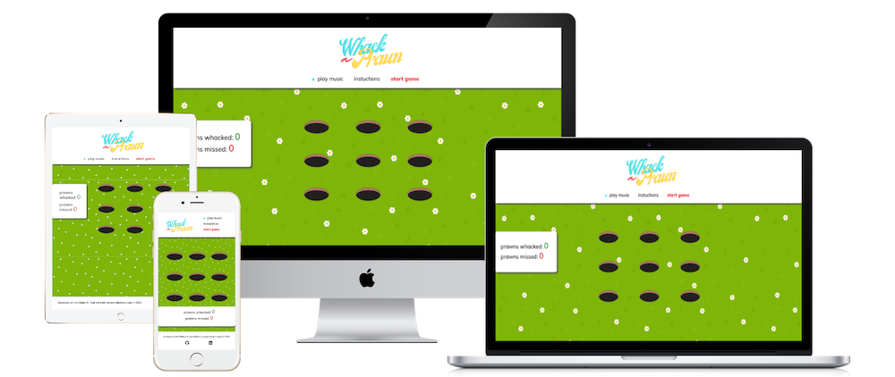
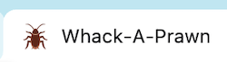
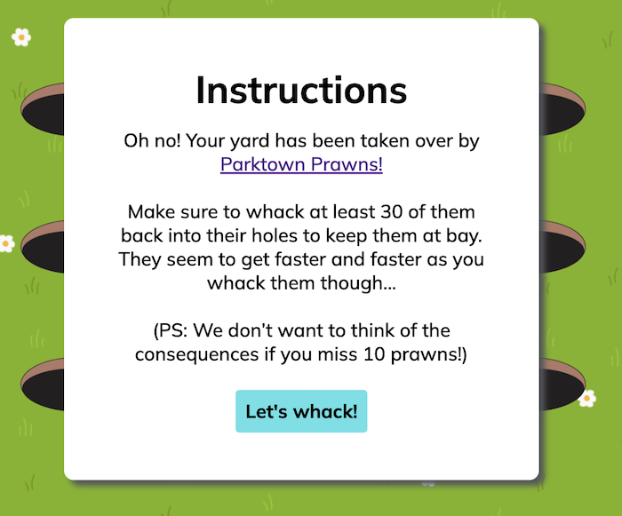
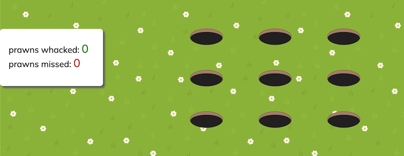
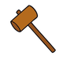
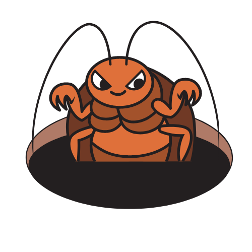
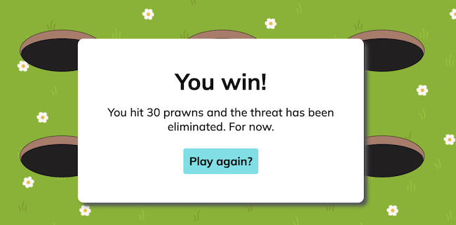
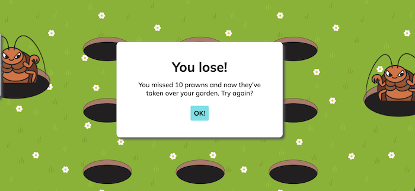

# __Whack-a-Prawn - Portfolio Project 2__
This is a website for Whack-a-Prawn, a whack-a-mole style game with a twist. The user’s yard has been taken over by [Parktown Prawns](https://en.wikipedia.org/wiki/Parktown_prawn), a large species of (much-disliked) cricket native to South Africa. The user will have to eliminate a certain amount of prawns from the yard in order to win the game. If the user misses 10 prawns, they lose the game. If they hit 30 prawns, they win the game.

The aim of this project was to build an interactive front-end site using Javascript, which responds to the user's actions and changes the way the site displays information according to said actions.

[Live website link](https://h-bails.github.io/whack-a-prawn/)

## __Value to the user__

I wanted to create a game that was familiar, but with a bit of a twist. Parktown Prawns are a very large, sometimes aggressive type of cricket native to South Africa, particularly the Highveld region. We all know we shouldn't squish them (they're actually valuable to the ecosystem and actually not at all a threat to one's garden) but we REALLY want to! This game gives the user an outlet for that frustration :) Of course, I anticipate that this game would be more popular with South African users given the infamy of the Parktown Prawn in popular culture and its ubiquity in everyday life in Johannesburg. 

The game is well suited to users looking for an element of challenge or wanting to text their dexterity, as it gets more difficult the higher the score!

## __UX & Design__
This is a simple game requiring only one page, with modal pop-ups for instructions and notifications. The remaining design is fairly straightforward, allowing the user to focus on the game without distraction. I did want to make it look quite cartoonish, as it's intended to be a fun and light-hearted game.

## __Wireframes__
Before the project build commenced, I used Figma to draw a loose mockup of the final result. 

## __Typography__
I used [Google Fonts](https://fonts.google.com/) to select and import the fonts used in the body text (Mulish).

I designed the logo myself using [Canva](https://canva.com).

## __Features__ 

- __Favicon__
    - A small insect serves as the favicon, so the user can easily identify the game’s tab in the browser. 

    

- __Whack-a-Prawn Logo__
    - The logo appears at the top of the page and shows the user the name of the game.
    

    
    

- __Control Buttons__
    - The top buttons (or rather, links) allow the user to control music, view instructions, and start the game.

    
    
- __Toggle Music button__
    -  This button allows the user to toggle the game's music. The music is turned ‘off’ by default as per best practice. 
- __Toggle Instructions button__
     - This button allows the user to view the premise of the game and how to play.
- __Start Game button__
     - This button sets the prawns in motion, displaying them in random divs to be whacked. The user has the option to reset the game on their second click.

- __Instructions Modal__
    - The instructions pop-up appears when the user clicks on the instructions button and explains the game's rules and controls. The box can be closed by clicking the "OK!" button at the bottom of the modal.
    

    

- __Game Area__
    - The game area consists of 9 ‘holes’ from which a prawn will pop up at random. There is also a scoreboard to the left to track how many prawns have been hit and/or missed. The prawns appear faster and faster as the score increases.

    

- __Game Area Cursor__
    - Styled as a hammer, ideal for whacking prawns.

    

- __Prawns__
    - These pop up in random divs (styled as holes in the ground) and make a satisfying 'whack' sound when hit, incrementing the user's score.

    

- __'You Win' Modal__
    - Appears when 10 or more prawns are whacked. A sound effect plays and clicking the button will reset the game.
    

    

- __'You Lose' Modal__
    - Appears when 5 or more prawns are missed. A sound effect plays and the background image changes. Clicking the button will reset the game.
    

    

- __Footer__
    - The footer displays my name, the Code Institute module, and a link to my GitHub and LinkedIn pages.
   
   
    

## __Features Left to Implement__

- __Cursor drop and smash__
    - I'd like to add a cursor effect where a little smash animation appears when a mole is hit. I have added the image in the [assets folder](./assets/images/cursor-smash.png), but unfortunately did not have time to implement before project hand-in. 

- __Modal UX__
    - I'd like the modals to close if the user clicks anywhere outside the box. I'd also like to blur or grey out the background when a modal appears.

- __Pause game__
    - I'd like the user to be able to either pause or reset the game depending on their preference.
    
- __High score__
    - I'd like to implement a score board or high score of some kind.

## __Languages Used__

- [HTML5](https://en.wikipedia.org/wiki/HTML5)
- [CSS3](https://en.wikipedia.org/wiki/CSS)
- [JavaScript](https://en.wikipedia.org/wiki/JavaScript)

## __Frameworks, Libraries & Programs Used__

- [Google Fonts](https://fonts.google.com/)
    - Used to import the Mulish font for use in the CSS styles.
- [Github](https://github.com/)
    - Used to store the project's code after being pushed from Git.
- [Gitpod](https://gitpod.io/)
    - Used to commit code using Git and push it to Github.
- [Canva](https://www.canva.com/)
    - Used to design the logo, prawns, prawn holes and background.
- [Figma](https://figma.com/)
    - Used to design the wireframes for the project.
- [Favicon.io](http://favicon.io)
    - Used to generate a favicon for the project.
- [Font Awesome](http://favicon.io)
    - Used to generate footer icons.
- [Websitemockupgenerator.com](https://websitemockupgenerator.com/)
    - Used to generate responsive mockups.

## __Testing__

- __Manual Testing__
    - The quiz was manually tested on a MacBook Pro, Samsung S10 and Google Chromebook. It was tested in Chrome, Safari and Firefox.
    - Developer Tools was used to make sure everything was responsive.

- __Lightouse Testing__
    - I used Lighthouse to test performance on Desktop and Mobile. Overall performance was 99/100 and results were above 89/100 across all areas.
    - [Link to Lighthouse report](https://pagespeed.web.dev/report?url=https%3A%2F%2Fh-bails.github.io%2Fwhack-a-prawn%2F&form_factor=desktop)

- __Validator Testing__

    - HTML
        - No errors were returned when passing through the official W3C validator
        - [Results](https://validator.w3.org/nu/?doc=https%3A%2F%2Fh-bails.github.io%2Fwhack-a-prawn%2F)
    - CSS
        - No errors were found when passing through the official (Jigsaw) validator
        - [Results](https://jigsaw.w3.org/css-validator/validator?uri=https%3A%2F%2Fh-bails.github.io%2Fwhack-a-prawn%2F&profile=css3svg&usermedium=all&warning=1&vextwarning=&lang=en)
    - JavaScript
        - [JSHint validator results](./assets/images/jshint-screenshot.png)
        - The following metrics were returned:
            - There are 8 functions in this file.
            - Function with the largest signature take 0 arguments, while the median is 0.
            - Largest function has 21 statements in it, while the median is 4.5.
            - The most complex function has a cyclomatic complexity value of 3 while the median is 1.5.
    - Accessibility
        - No errors were found when passing through the WAVE aaccessibility tool
        - [Results](https://wave.webaim.org/report#/https://h-bails.github.io/whack-a-prawn/)

## __Fixed bugs__

- Fixed bug where 'Instructions' button required two clicks to bring up modal.

## __Unfixed bugs__

- The 'whack' sound sometimes lags when the prawns speed up, especially in Safari. This is a known bug and will be fixed in future.

## __Deployment__

The site is deployed to GitHub pages. The steps to deploy are: 
  - In the [GitHub repository](https://github.com/h-bails/whack-a-prawn), navigate to the Settings tab. 
  - On the left-hand menu, click on “Pages”. 
  - From the source section drop-down menu, select the **Main** Branch, then click "Save".
  - The page will be automatically refreshed with a detailed ribbon display to indicate the successful deployment.

The live link can be found [here.](https://h-bails.github.io/whack-a-prawn/)

## __Credits__

### __Code__

- This [Stack Overflow](https://stackoverflow.com/questions/51276757/how-to-toggle-audio-play-pause-with-a-button-click) thread was helpful in figuring out how to toggle music. 
- This [Stack Overflow](https://stackoverflow.com/questions/55071684/why-my-show-hide-button-needs-double-click-on-first-time) thread was helpful in helping me figure out why my Instuctions modal required two clicks to activate. 
- [ChatGPT](https://chat.openai.com/chat) was helpful in suggesting how I could increase the speed of the prawns based on the user's score.

### __Content__

- All website text content was created and written by me.

### __Media__

- Game images and background were designed by me with [Canva.](https://www.canva.com/)
- Background music is Disco con Tutti by Kevin MacLeod is licensed under a [Creative Commons Attribution 4.0 license.](https://creativecommons.org/licenses/by/4.0/)
- Sound effect Kung Fu Punch 4 is from peridactyloptrix on [Pixabay](https://pixabay.com/sound-effects/kung-fu-punch-4-105262/) and is [free for commercial and noncommercial use](https://pixabay.com/service/license/).
- Sound effect Success Fanfare Trumpets is from FunWithSound on [Pixabay](https://pixabay.com/sound-effects/success-fanfare-trumpets-6185/) and is [free for commercial and noncommercial use](https://pixabay.com/service/license/).
- Sound effect Cartoon Laugh is from JohnsonBrandEditing on [Pixabay](https://pixabay.com/sound-effects/cartoon-laugh-6457/) and is [free for commercial and noncommercial use](https://pixabay.com/service/license/).

## __Acknowledgements__

I would like to give special thanks to my partner, Harry O’Connor, for dealing with my gremlin mood during this project (and module) and picking up the slack around the house to free up time for me!
